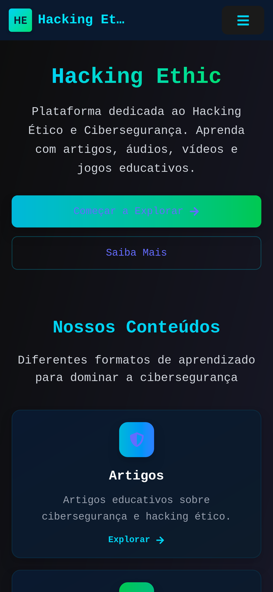
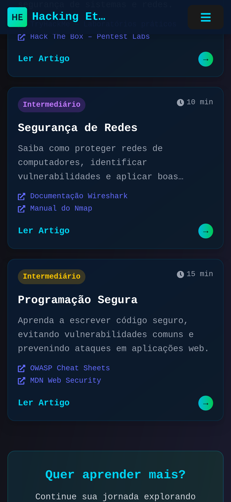
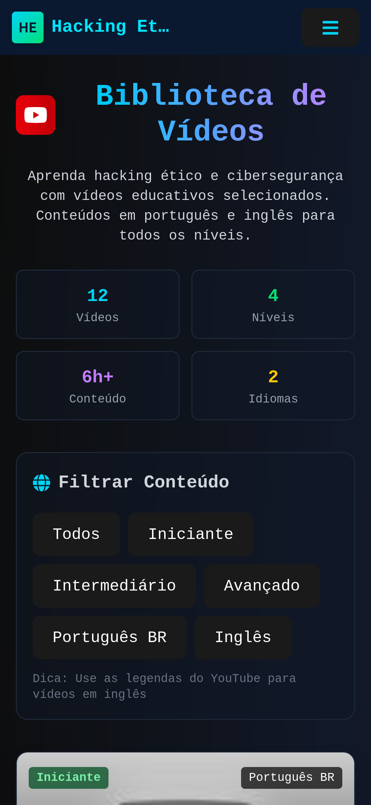
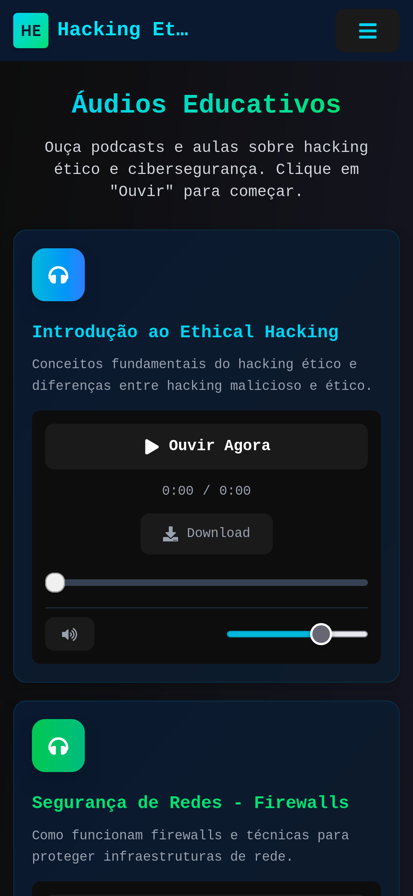
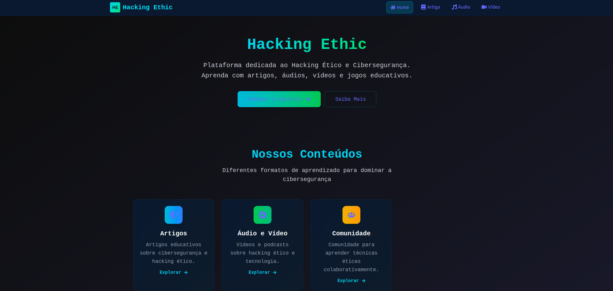
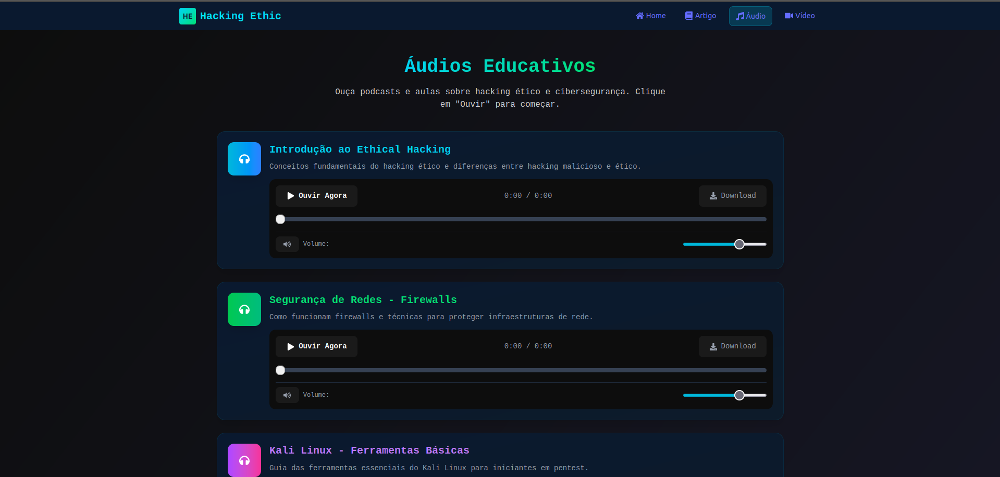

# 📸 Capturas de Tela – CyberEthic

Este documento apresenta as capturas de tela da plataforma Hacking Ethic, organizadas por páginas e dispositivos.

---

## 📱 Mobile (375x812)

### 1. Home Page

**Descrição:** Página inicial da plataforma em formato mobile. 

---

### 2. Página de Artigos

**Descrição:** Listagem de artigos educativos em formato mobile.

---

### 3. Página de Vídeos

**Descrição:** Biblioteca de vídeos educativos em mobile.

---

### 4. Página de Áudio

**Descrição:** Player de podcasts e conteúdos de áudio sobre cibersegurança.

---

## 🖥️ Desktop (1920x1080)

### 5. Home Page

**Descrição:** Página inicial em desktop com layout completo. 

---

### 6. Página de Artigos

**Descrição:** Interface desktop dos artigos com sidebar de navegação e área de conteúdo principal. Layout de duas colunas com sistema de filtros avançados.

---

### 7. Página de Vídeos

**Descrição:** Grid de vídeos em desktop com 3 colunas. Interface rica com preview dos vídeos, sistema de filtros avançado e seção de recomendações.

---

### 8. Página de Áudio

**Descrição:** Player de áudio desktop.